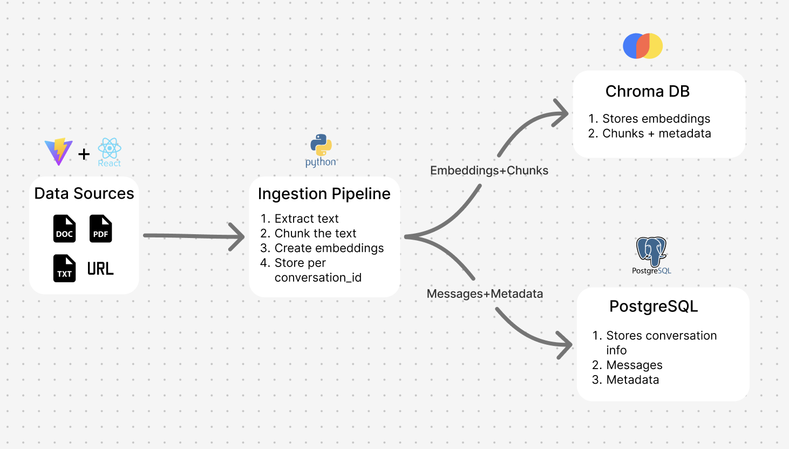
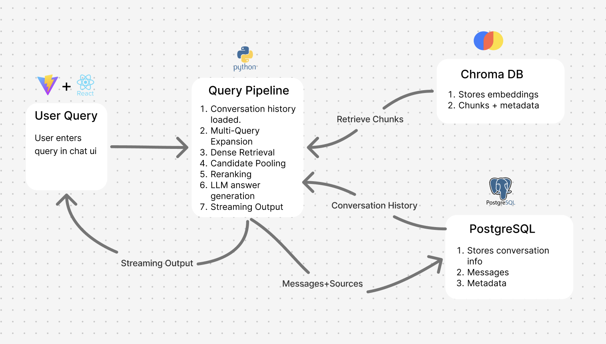
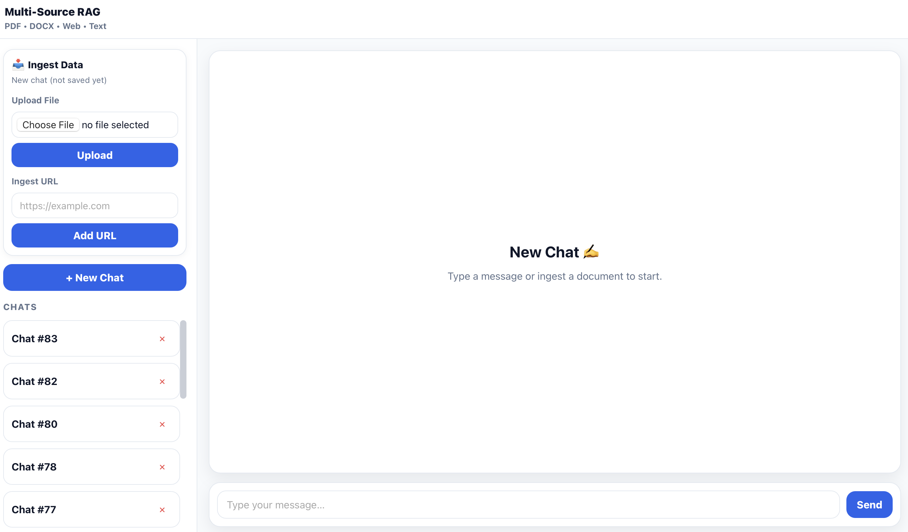
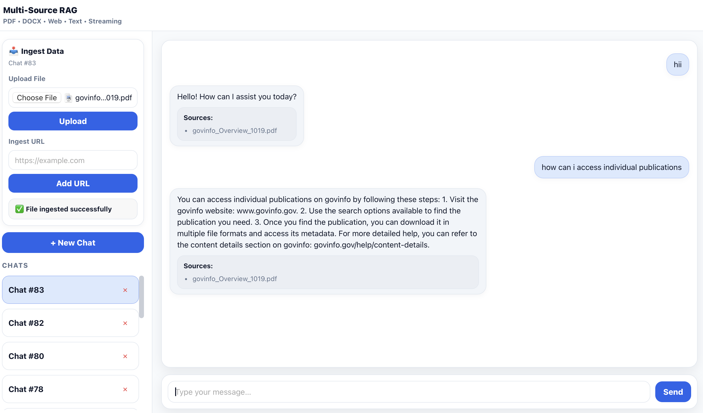

# Multi-Source RAG 🚀

A **production-oriented Multi-Source Retrieval Augmented Generation (RAG)** system that ingests knowledge from documents and websites, then enables conversational querying with **hybrid retrieval**, **streaming responses**, **metadata-aware citations**, and a modern UI.

This project emphasizes **evaluation-driven architecture decisions** rather than feature bloat.


## 📸 Screenshots

### 🏗️ Architecture (Ingestion)


### 🏗️ Architecture (Query Pipeline)


### 💻 UI (Light/Dark + Draft Chat)


### 💻 UI (Chat + Sources + Ingestion)



## ✨ Key Capabilities

### ✅ Multi-Source Ingestion
- File ingestion: **PDF, DOCX, TXT**
- Web URL ingestion
- OCR-supported ingestion for scanned documents
- Chunking, embedding, and storage in a vector database with metadata

### ✅ Hybrid Retrieval (Primary Pipeline)
- Combines **dense embeddings + keyword/BM25-style retrieval**
- Metadata-aware chunk retrieval with stable source attribution
- Optimized for small–medium corpora using empirical evaluation results

### ✅ Retrieval Evaluation Framework
- Custom evaluation harness to benchmark:
  - Dense vs Hybrid vs Multi-query vs Reranking pipelines
  - Latency and keyword-level correctness
- JSON-based result logging with timestamps
- Evaluation results used to **simplify and harden the production pipeline**

### ✅ Conversational Memory
- Multi-conversation support
- Chat history persisted in **PostgreSQL**
- Draft chat mode (UI-only) until first interaction

### ✅ Streaming Answers + Citations
- Token-level streaming responses
- Stable, numbered source citations shown with each assistant message
- Metadata preserved end-to-end from ingestion to answer

### ✅ Modern UI
- Clean chat interface with draft conversations
- Light/Dark mode with persistent theme
- Responsive sidebar for conversations and ingestion


## 🧱 Tech Stack

### Backend
- FastAPI
- PostgreSQL (conversation + message storage)
- ChromaDB (vector database)
- OpenAI API (LLM + embeddings)
- HuggingFace Cross-Encoder (evaluation & reranking experiments)

### Frontend
- React (Vite)
- Streaming via Fetch + ReadableStream
- Minimal, UX-focused chat interface


## ⚡ Quick Start (Local)

### Backend
```bash
cd backend
pip install -r requirements.txt
uvicorn app.main:app --reload
```

API Docs:
```
http://127.0.0.1:8000/docs
```

### Frontend
```bash
cd rag-ui
npm install
npm run dev
```

UI:
```
http://127.0.0.1:5173
```


## 🐳 Run with Docker

```bash
docker compose up --build
```

Stop:
```bash
docker compose down
```


## 🔗 Core API Routes

### Chat
- `POST /query` — Non-streaming response
- `POST /query/stream` — Streaming response

### Conversations
- `POST /conversations`
- `GET /conversations`
- `GET /conversations/{id}`
- `DELETE /conversations/{id}`

### Ingestion
- `POST /ingest`
- `POST /ingest/url`


## 🧠 Architectural Notes

- Hybrid retrieval is the **default production pipeline**, chosen after empirical evaluation.
- Multi-query expansion and reranking are retained as experimental modules but excluded from the hot path due to high latency with minimal gains.
- The system prioritizes **clarity, observability, and correctness** over feature overload.

